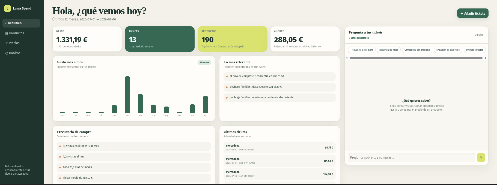

# Luma Spend — Process Documents API

> API REST para extraer y analizar tickets de supermercado con FastAPI, LLMs y Railway.

Sube una foto de tu ticket → los datos quedan estructurados en base de datos → consulta tu historial de compras en lenguaje natural.

---

## Endpoints

| Método | Ruta | Descripción |
|--------|------|-------------|
| `GET` | `/api/v1/health` | Estado de la API |
| `POST` | `/api/v1/documents/extract` | Extrae un ticket (imagen o PDF) y lo almacena |
| `POST` | `/api/v1/documents/batch` | Extrae varios tickets a la vez |
| `GET` | `/api/v1/dashboard/report` | Datos de analíticas de gasto |
| `POST` | `/api/v1/chat` | Pregunta al agente en lenguaje natural |
| `GET` | `/` | Dashboard HTML |

Todos los endpoints bajo `/api/v1/` requieren autenticación Bearer (`MASTER_KEY`).  
Documentación interactiva: `/docs` (Swagger UI) · `/redoc`.

---

## Arrancar en local

```bash
python -m venv venv
source venv/bin/activate
pip install -r requirements.txt

# Copiar y editar variables de entorno
cp .env.example .env

# Crear la base de datos
alembic upgrade head

# Arrancar con recarga automática
uvicorn app.main:app --reload --app-dir src
```

```bash
# Tests
pytest tests/
```

---

## Variables de entorno

| Variable | Obligatoria | Default | Descripción |
|----------|-------------|---------|-------------|
| `MASTER_KEY` | ✅ | `changeme` | Clave de autenticación de la API |
| `OPENAI_API_KEY` | ✅ | — | Clave de OpenAI (o proveedor compatible) |
| `OPENAI_BASE_URL` | — | — | URL base alternativa (Novita, etc.) |
| `OPENAI_MODEL` | — | `gpt-4.1-mini` | Modelo para extracción estructurada |
| `OPENAI_CHAT_MODEL` | — | `google/gemma-4-31b-it` | Modelo para el agente de chat |
| `SCANEAME_API_KEY` | — | — | Clave de Scanéame (si se usa OCR externo) |
| `SCANEAME_API_URL` | — | `https://scaneame.iamdgarcia.com/v1/process` | URL de Scanéame |
| `SCANEAME_ENDPOINT` | — | `tickets` | Endpoint de Scanéame |
| `SCANEAME_REQUEST_TIMEOUT_SECONDS` | — | `60` | Timeout por petición HTTP |
| `SCANEAME_PROCESSING_TIMEOUT_SECONDS` | — | `180` | Timeout total para jobs asíncronos |
| `SCANEAME_POLL_INTERVAL_SECONDS` | — | `1` | Intervalo de polling de jobs |
| `DATABASE_URL` | — | `sqlite:///./receipts.db` | Conexión a base de datos |
| `LANGSMITH_API_KEY` | — | — | Clave de LangSmith para trazas |
| `LANGSMITH_PROJECT` | — | — | Proyecto en LangSmith |

---



## Stack

**Python 3.12 · FastAPI · SQLAlchemy · Alembic · Pydantic · OpenAI SDK · httpx · LangSmith · Docker · Railway**

- **Extracción**: imagen/PDF → LLM multimodal → `StructuredExtraction` (Pydantic)
- **OCR externo**: Scanéame como alternativa gestionada al LLM propio
- **Base de datos**: SQLite en desarrollo, PostgreSQL en producción (sin cambiar código)
- **Agente**: tool calling con 6 herramientas SQL sobre los tickets almacenados
- **Observabilidad**: trazas y evaluaciones automáticas con LangSmith

---

## Curso

El proyecto se documenta como tutorial completo en [`docs/curso/`](docs/curso/README.md):

| # | Módulo |
|---|--------|
| 00 | [Introducción y visión general](docs/curso/00_introduccion.md) |
| 01 | [FastAPI: el núcleo del backend](docs/curso/01_fastapi.md) |
| 02 ⭐ | [Structured Output con LLM](docs/curso/02_structured_output.md) |
| 03 | [Integración con Scanéame](docs/curso/03_scaneame.md) |
| 04 | [Base de datos: SQLAlchemy + Alembic](docs/curso/04_base_de_datos.md) |
| 05 | [Agente Conversacional con Tool Calling](docs/curso/05_agente.md) |
| 06 | [Dashboard de Analíticas](docs/curso/06_dashboard.md) |
| 07 | [Evaluaciones con LangSmith](docs/curso/07_evaluaciones.md) |
| 08 | [Despliegue en Railway](docs/curso/08_despliegue.md) |

Diagramas de arquitectura: [`docs/diagram.drawio`](docs/diagram.drawio)

---

## Sesiones en directo

| # | Fecha | Título | Módulos |
|---|-------|--------|--------|
| 1 | Jul 19 | [Setup de stream y estructura inicial de la API](https://iamdgarcia.substack.com/p/probamos-stream-desde-obs-y-montamos) | 00, 01, 02 |
| 2 | Jul 26 | [Extracción de documentos con IA (Parte 2)](https://iamdgarcia.substack.com/p/creando-una-app-para-procesar-documentos) | 02, 03 |
| 3 | Ago 2 | [Dashboard de explotación con Claude Code](https://iamdgarcia.substack.com/p/desarrollando-una-app-para-procesar) | 06 |
| 4 | Ago 9 | [Primeras validaciones: duplicados y supermercados](https://iamdgarcia.substack.com/p/creando-una-app-para-procesar-documentos-263) | 04 |
| 5 | Ago 16 | [Comparaciones semánticas y fuzzy matching](https://iamdgarcia.substack.com/p/creando-una-app-para-procesar-documentos-714) | 04, 05 |
| 6 | Ago 23 | [Desplegamos el proyecto en Railway](https://iamdgarcia.substack.com/p/creando-una-app-para-procesar-documentos-411) | 08 |

Todas las sesiones: [iamdgarcia.substack.com/s/directos](https://iamdgarcia.substack.com/s/directos)
