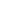

# Módulo 05 — Agente Conversacional con Tool Calling

**Ficheros:** `src/app/services/chat.py` · `src/app/repositories/analytics.py`

---

## ¿Qué es tool calling?

Los LLMs modernos pueden declarar que quieren llamar a una función externa antes de responder. El flujo es:

1. Le dices al LLM qué herramientas tiene disponibles (nombre, descripción, parámetros)
2. El LLM decide si necesita llamar alguna herramienta para responder
3. Tú ejecutas la herramienta y le devuelves el resultado
4. El LLM genera la respuesta final usando ese resultado

Esto permite que el LLM responda con datos reales de tu base de datos, sin inventarse nada.

---

## Definir herramientas

Cada herramienta se declara como un `ChatCompletionToolParam`:

```python
COMPARE_PRODUCT_PRICES_TOOL = ChatCompletionToolParam(
    type="function",
    function={
        "name": "compare_product_prices",
        "description": "Historial cronológico de precios de un producto y variación entre el primero y el último. Usa esta herramienta para preguntas sobre el precio o su evolución.",
        "parameters": {
            "type": "object",
            "properties": {
                "product_name": {
                    "type": "string",
                    "description": "Nombre o parte del producto (sin tildes si no hay resultados).",
                },
                "days": {"type": "integer", "default": 3650},
            },
            "required": ["product_name"],
        },
    },
)
```

**La descripción es crítica**: el LLM decide qué herramienta llamar basándose en ella. Una descripción ambigua lleva a llamadas incorrectas. Hay que ser muy explícito sobre cuándo usar cada herramienta y cuándo *no* usarla.

---

## Las 6 herramientas del agente

| Herramienta | Parámetros | Cuándo usarla |
|-------------|-----------|---------------|
| `compare_product_prices` | `product_name`, `days` | Preguntas sobre precio o su evolución |
| `get_spending_summary` | `days` | Gasto total o por supermercado |
| `get_product_quantities` | `days`, `limit` | Cuánto o cuántas veces se compró un producto |
| `get_purchase_frequency` | `days` | Frecuencia de compra |
| `get_list_tickets` | `limit` | Listar tickets recientes (solo IDs) |
| `get_ticket_data` | `ticket_id` | Detalle de un ticket concreto |

---

## El loop del agente

```python
def chat(self, message: str) -> str:
    self.messages.append({"role": "user", "content": message})

    for _ in range(8):                          # máximo 8 iteraciones
        response = self._call_llm(self.messages)
        assistant_msg = response.choices[0].message
        self.messages.append(assistant_msg.model_dump(exclude_none=True))

        if not assistant_msg.tool_calls:        # el LLM responde directamente
            return assistant_msg.content or ""

        for tool_call in assistant_msg.tool_calls:
            result = self._handle_tool_call(
                tool_call.function.name,
                json.loads(tool_call.function.arguments),
            )
            self.messages.append({              # devolver resultado al LLM
                "role": "tool",
                "tool_call_id": tool_call.id,
                "content": json.dumps(result, ensure_ascii=False),
            })

    return "No he podido completar la consulta después de varios pasos."
```

El límite de 8 iteraciones evita bucles infinitos si el LLM entra en un ciclo de llamadas.

---

## System prompt con reglas de routing

El system prompt es el documento de instrucciones del agente. Incluye reglas explícitas para evitar ambigüedades:

```python
SYSTEM_MESSAGE = {
    "role": "system",
    "content": (
        "Eres el asistente de Luma Spend. Responde en español, breve. "
        "Usa siempre las herramientas; nunca inventes datos. "
        "Reglas de uso de herramientas: "
        "precio o evolución de precio → compare_product_prices; "
        "cantidad comprada o veces que se compró → get_product_quantities; "
        "gasto total o por supermercado → get_spending_summary (sin llamar antes a get_list_tickets); "
        "frecuencia de compra → get_purchase_frequency; "
        "listar compras recientes → get_list_tickets (no llames a get_ticket_data salvo que el usuario pida los productos de un ticket concreto). "
        "Usa el mínimo de llamadas necesarias. "
        "Si compare_product_prices devuelve history vacío, reintenta con el nombre sin tildes."
    ),
}
```

**Antipatrón que evitamos**: sin estas reglas, el LLM tiende a llamar a `get_list_tickets` antes de cada consulta de gasto, añadiendo una llamada innecesaria.

---

## Ejecutar la herramienta

```python
def _handle_tool_call(self, tool_name: str, arguments: dict) -> Any:
    match tool_name:
        case "compare_product_prices":
            return self._analytics.compare_product_prices(
                arguments.get("product_name", ""), arguments.get("days", 3650)
            )
        case "get_spending_summary":
            return self._analytics.get_spending_summary(arguments.get("days", 365))
        case "get_list_tickets":
            return self._repository.get_ticket_list(arguments.get("limit", 10))
        ...
```

---

## Trazado con LangSmith

```python
@traceable(run_type="chain", name="Luma Agent")
def chat(self, message: str) -> str: ...

@traceable(run_type="llm", name="Chat Completion", metadata={...})
def _call_llm(self, messages: list) -> ChatCompletion: ...
```

`run_type="chain"` marca el agente completo como una cadena. `run_type="llm"` marca cada llamada individual al modelo. LangSmith los agrupa jerárquicamente, mostrando el árbol de ejecución completo.

---

## Siguiente módulo

→ [06 — Dashboard de Analíticas](06_dashboard.md)
